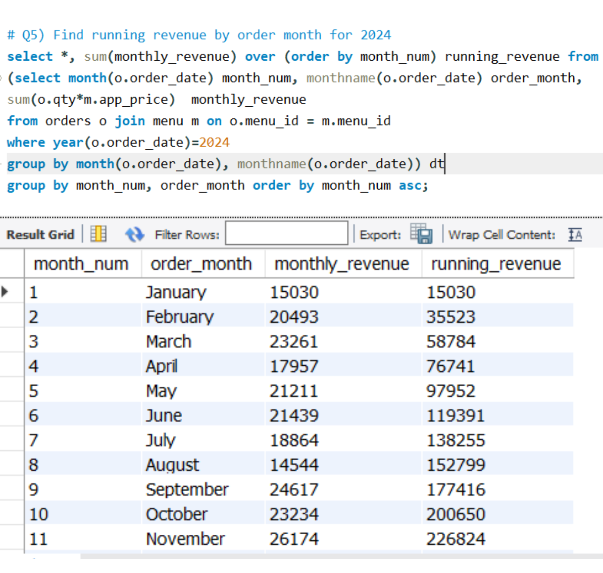
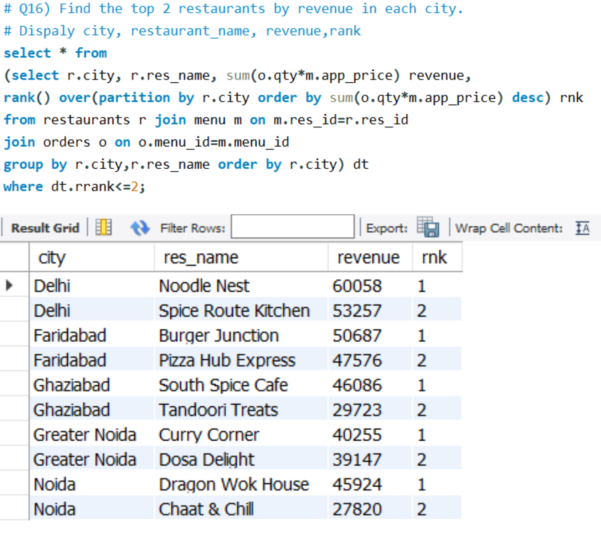
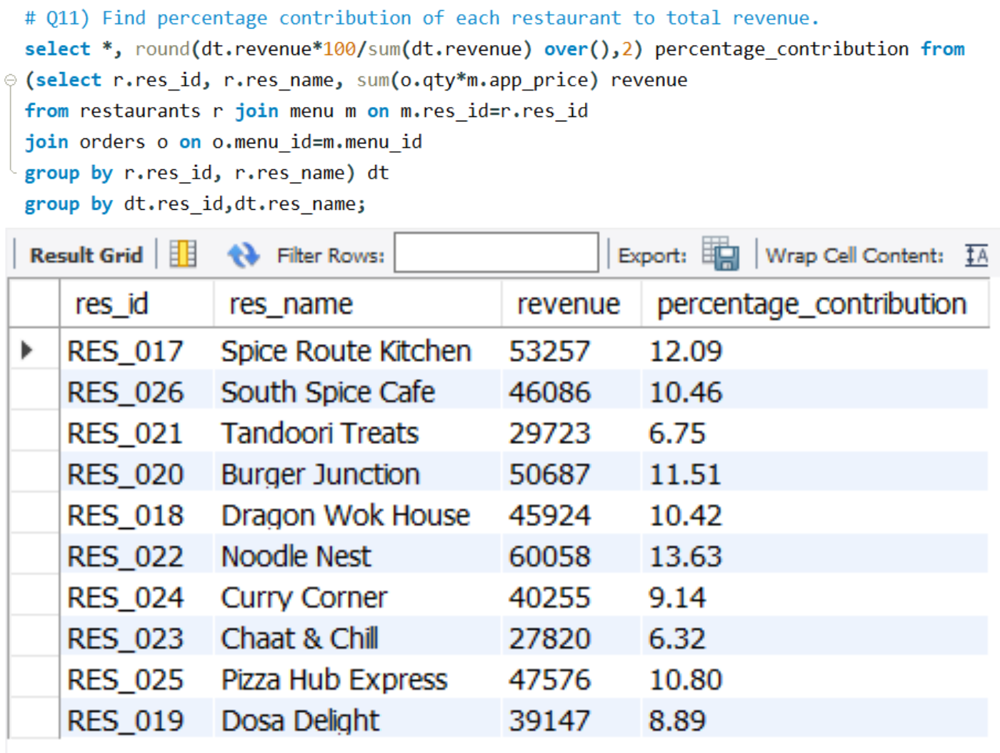
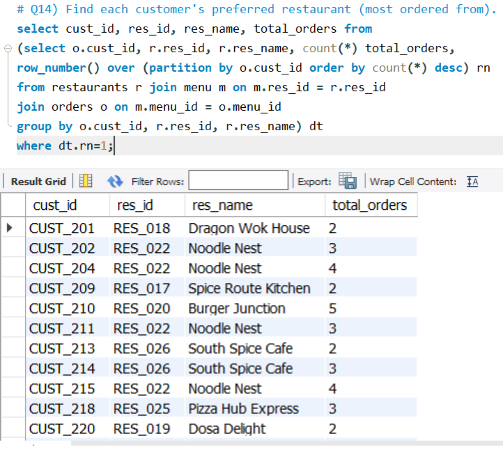
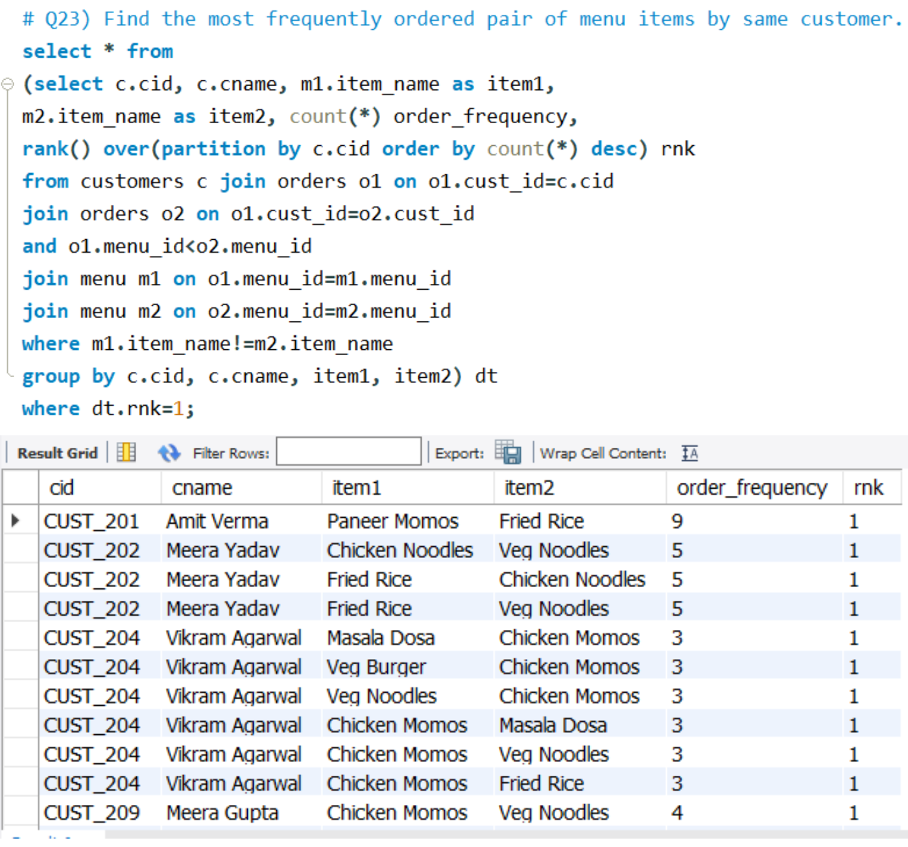

# 🍽 SQL Food Delivery Analysis Project

## Project Overview

This project analyzes food delivery business data using SQL to solve real-world analytical problems.

The project uses concepts such as joins, subqueries, self joins, aggregations, and window functions to analyze customer behavior, restaurant performance, and revenue trends.

----

# 🛠 SQL Concepts Used

- Joins
- Subqueries
- Window Functions
- Self Joins
- Aggregations
- Ranking Functions
- GROUP BY & HAVING

---

# 📊 Business Problems Solved

- Top spending customers
- Running revenue analysis
- Top restaurants by revenue
- Customer ordering behavior analysis
- Most frequently ordered item pairs
- Consecutive-day customer orders

---

# 🖼 Project Screenshots

## Running Revenue Analysis
![Running Revenue](# 🍽 SQL Food Delivery Analysis Project

## 📌 Project Overview

This project analyzes food delivery business data using SQL to solve real-world analytical problems.

The project uses concepts such as joins, subqueries, self joins, aggregations, and window functions to analyze customer behavior, restaurant performance, and revenue trends.

---

# 🛠 SQL Concepts Used

- Joins
- Subqueries
- Window Functions
- Self Joins
- Aggregations
- Ranking Functions
- GROUP BY & HAVING

---

# 📊 Business Problems Solved

- Top spending customers
- Running revenue analysis
- Top restaurants by revenue
- Customer ordering behavior analysis
- Most frequently ordered item pairs
- Consecutive-day customer orders

---

# 🖼 Project Screenshots

## Running Revenue Analysis

---

## Top Restaurants by Revenue for each City

---

## Percentage Contribution of Restaurant to Grand Total

---

## Customers Preferred Restaurants

---
  
## Frequent Item Pairs

---

# 💻 Tools Used

- MySQL
- SQL
- CSV Datasets

---

# 👨‍💻 Author

**Nitin Prasad Banduni**

GitHub: https://github.com/NitinPrasadBanduni)
